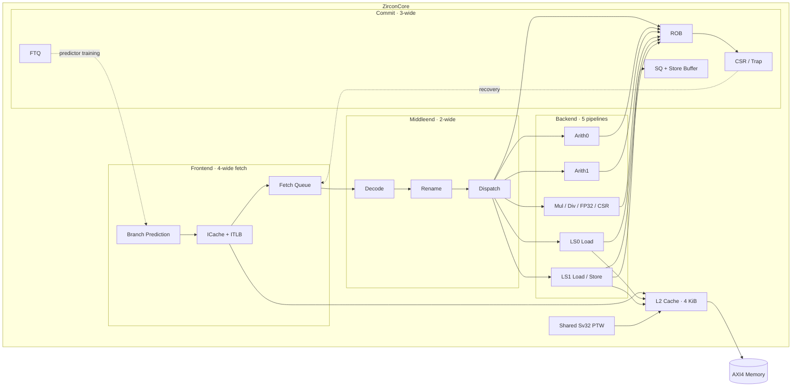

<div align="center">

# Zircon-2026

**面向密集控制流程序的 RV32 乱序处理器**

[](https://riscv.org/technical/specifications/)
[](https://www.chisel-lang.org/)
[](https://github.com/riscv-software-src/riscv-isa-sim)
[](LICENSE)

[架构概览](#架构概览) · [快速开始](#快速开始) · [验证状态](#验证状态) · [模块文档](docs/README.md)

</div>

Zircon-2026 是一个面向密集控制流程序、使用 Chisel 编写的 32 位 RISC-V 乱序处理器。当前核心
包含四指令取指、双宽译码与派发、三宽退休、两条整数/分支流水线、一条共享整数乘除与 FP32
流水线，以及两条访存流水线。存储系统由独立 L1 ICache/DCache、Sv32 ITLB/DTLB、硬件页表
遍历器和一颗偏 victim 组织的共享 L2 Cache 构成。

项目同时面向两类实现环境：Vivado 路径使用可推断双口 BRAM，ASIC 静态分析路径提供寄存器
模型和 OpenRAM `1RW+1R` 接口。整核仿真由 Verilator 驱动，并在提交点与 Spike 逐条差分。

> [!NOTE]
> 当前版本已稳定运行裸机功能程序与 CoreMark，但尚未宣称可以启动通用操作系统。Sv32、M/S/U
> 特权状态和异常路径已经接入整核；PMP、完整系统软件启动与更广泛的特权架构验证仍在后续范围内。

## 架构概览



### 默认配置

| 项目 | 当前配置 |
| --- | --- |
| ISA | `RV32IMAF_Zicsr_Zifencei_Zaamo_Zalrsc` |
| 取指 / 译码与派发 / 退休宽度 | 4 / 2 / 3 |
| 整数 / 浮点物理寄存器 | 72 / 48 |
| ROB / SQ / Store Buffer | 48 / 12 / 4 项 |
| FTQ / Fetch Queue | 16 / 8 项 |
| 计算流水线 | 2 x `ArithBranch` + 1 x `MixArithPipeline` |
| 访存流水线 | LS0 Load + LS1 Load/Store Address，Store Data 独立发射 |
| L1 ICache / DCache | 各 2 KiB，2 路组相连，32 B Cache Line |
| L2 Cache | 4 KiB，4 路组相连，32 B Cache Line |
| ITLB / DTLB | 4 组 x 4 路，另含 4 项 4 MiB 大页表 |
| 地址宽度 | 32 位虚拟地址，34 位物理地址 |

### 关键设计

- **乱序后端**：六个压缩式发射队列连接五条执行流水线；Load replay 保留原队列年龄并原位重发。
- **统一混合计算通路**：整数乘除、FP32 运算与 CSR 顺序访问共享 `MixArithPipeline`，CSR 仅在
  获得 ROB 头授权后执行。
- **双 Load 能力**：LS0 与 LS1 可以同时执行 Load；Store Address 与 Store Data 分离调度，
  SQ 和 Store Buffer 提供逐字节前递。
- **RV32 原子操作**：支持 `LR.W`、`SC.W` 和九条 `AMO.W` 指令；原子操作在 ROB 头获得授权，
  复用 LS1 与 DCache Store 端口完成不可分割的读改写。
- **三级 L1 命中流水**：ICache 与 DCache 将 miss 状态寄存后交给末级状态机，避免 miss 控制
  直接回到前级关键路径。
- **偏非包含式 L2**：L2 主要接收 L1 victim；L1/L2 同时 miss 时，外部填充直接返回 L1，
  减少 L1 与 L2 的重复数据。
- **Sv32 地址翻译**：独立 ITLB、双查询端口 DTLB 和共享硬件 PTW 已接入整核，PTW 的 I/D
  请求分别复用 L2 的指令侧与数据侧通道。

## 快速开始

### 环境依赖

- CMake 3.25 或更新版本
- JDK 与 sbt
- Verilator
- Spike（`riscv-isa-sim`）
- Spike 开发库及 `riscv-riscv.pc`
- 支持 RV32 裸机目标的 GCC 工具链

### 获取与构建

```sh
git clone --recurse-submodules https://github.com/MAdrid1011/Zircon-2026.git
cd Zircon-2026
cmake -S . -B build/cmake -DCMAKE_BUILD_TYPE=Release
cmake --build build/cmake --target zircon-sim --parallel
```

已有工作区可以单独初始化两个子仓库：

```sh
git submodule update --init --recursive
```

### 运行 CoreMark

```sh
cmake --build build/cmake --target coremark --parallel
```

该目标会依次构建 RV32 CoreMark、生成整核 SystemVerilog、增量编译 Verilator 仿真器，并启用
提交级 Spike 差分。运行报告写入 `reports/`。

### 运行单个功能测试

```sh
cmake --build build/cmake --target functest-add --parallel
```

将 `add` 替换为 `RV-Software/functest/src/` 中对应的源文件名即可选择其他功能测试。

### 运行 RISC-V 架构测试

```sh
make -C RV-Software/arch-test run
```

当前精简测试集使用 Clang 构建 149 项正式 RISC-V Architecture Test，并通过 ZirconSim 与
进程内 Spike 逐提交对拍。覆盖范围和工具要求见 `RV-Software/arch-test/README.md`。

### 生成 RTL

```sh
sbt "runMain Elaborate generated"
```

仿真顶层需要额外的退休与性能观测接口：

```sh
sbt "runMain Elaborate --simulation generated"
```

## 验证状态

当前默认配置使用 72 个整数物理寄存器。CoreMark 单次迭代的最近一次完整运行结果如下：

| 工作负载 | 退休指令 | 周期 | IPC | 差分结果 |
| --- | ---: | ---: | ---: | --- |
| CoreMark | 374,266 | 371,708 | 1.006882 | Spike 通过 |

上述数值是 Verilator 上的微架构统计结果，不代表 CoreMark/MHz，也不包含 FPGA 或 ASIC 的工作
频率结论。正常构建不生成波形，性能计数器在程序结束时集中读取，以减少仿真接口采样开销。

| 验证层级 | 当前状态 |
| --- | --- |
| CoreMark + Spike 提交级差分 | 通过 |
| RISC-V Architecture Test 149 项 + Spike 提交级差分 | 通过 |
| 整数、乘除与 FP32 模块向量测试 | 已提供 |
| ICache、DCache 与 L2 随机压力测试 | 已提供 |
| ITLB、DTLB 与 L1 集成测试 | 已提供 |
| Sv32 操作系统级端到端启动 | 尚未完成 |
| PMP 与完整特权架构一致性验证 | 尚未完成 |

## 模块文档

| 子系统 | 内容 |
| --- | --- |
| [处理器顶层](docs/Core.md) | 整核连接、外部接口、恢复与维护控制 |
| [前端](docs/Frontend.md) | 取指流水、分支预测、ICache、ITLB 与 Fetch Queue |
| [中端](docs/Middleend.md) | Decode、Rename、ReadyBoard 与 Dispatch |
| [后端](docs/Backend.md) | Issue Queue、执行流水线、PRF、旁路与唤醒 |
| [提交与恢复](docs/Commit.md) | ROB、FTQ、SQ、Store Buffer、CSR 与异常恢复 |
| [存储系统](docs/Memory.md) | L1、L2、TLB、PTW、PMA 与 RAM 后端 |

完整入口见 [docs/README.md](docs/README.md)。这些页面只描述当前 RTL，不包含迁移记录和开发过程。

## 仓库结构

```text
Zircon-2026/
├── src/main/scala/       # Chisel RTL 与参数
│   ├── Frontend/         # 取指、预测、ICache
│   ├── Middleend/        # 译码、重命名、派发
│   ├── Backend/          # 发射、执行、DCache
│   ├── Commit/           # ROB、FTQ、SQ、CSR
│   ├── Memory/           # TLB、PTW、L2、AXI Bridge
│   └── Config/           # 参数与跨模块接口
├── src/test/scala/       # 当前模块与子系统验证
├── docs/                 # 当前架构文档
├── eda/                  # Nangate45 参考库与 RAM 模型
├── RV-Software/          # 裸机程序与基准测试子模块
└── ZirconSim/            # Verilator + Spike 仿真子模块
```

生成 RTL、构建产物、波形和运行报告分别写入 `generated/`、`build/` 与 `reports/`，不会进入版本库。

## 波形调试

普通构建关闭波形支持。需要调试时应使用独立构建目录，并限制波形起始周期和持续长度：

```sh
cmake -S . -B build/wave -DZIRCON_SIM_ENABLE_VCD=ON
cmake --build build/wave --target zircon-sim --parallel
build/wave/bin/zircon-sim --elf program.elf --wave trace.vcd \
    --wave-start 10000 --wave-cycles 2000
```

## 开源许可

Zircon-2026 使用 [Mozilla Public License 2.0](LICENSE)。`RV-Software`、`ZirconSim` 和
`eda/` 中的第三方数据分别保留其上游许可证。
