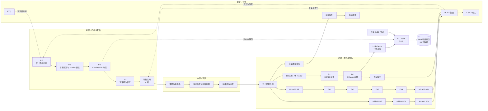

<div align="center">

# Zircon-2026

**面向密集控制流程序的 RV32 乱序处理器**

[](https://riscv.org/technical/specifications/)
[](https://www.chisel-lang.org/)
[](https://github.com/riscv-software-src/riscv-isa-sim)
[](LICENSE)

[架构概览](#架构概览) · [快速开始](#快速开始) · [验证状态](#验证状态) · [模块文档](docs/README.md)

</div>

Zircon-2026 是一个面向密集控制流程序、使用 Chisel 编写的 32 位 RISC-V 乱序处理器。当前核心
包含四指令取指、三宽译码与派发、三宽退休、两条整数/分支流水线、一条共享整数乘除与 FP32
流水线，以及两条访存流水线。存储系统由独立 L1 ICache/DCache、Sv32 ITLB/DTLB、硬件页表
遍历器和一颗偏 victim 组织的共享 L2 Cache 构成。

项目同时面向两类实现环境：Vivado 路径使用可推断双口 BRAM，ASIC 静态分析路径将全部 SRAM
统一绑定到 BSG Fakeram 时序模型。整核仿真由 Verilator 驱动，并在提交点与 Spike 逐条差分。

本项目延续早期的 [Zircon](https://github.com/MAdrid1011/Zircon) 与
[Zircon-2024](https://github.com/MAdrid1011/Zircon-2024) 处理器工作，在取指预测、乱序执行和
存储层次上形成当前实现。两个早期仓库保留各自的设计和实验资料，可用于了解这一研究方向的背景。

> [!NOTE]
> 当前版本已在 Spike 逐提交差分下启动 Linux 6.1.44，进入交互式 BusyBox shell，并完成命令
> 输入、文件系统挂载和定时器路径验证。Nangate45 BSG 纯逻辑时序分析测得最长数据到达时间
> 为 1.474616 ns，在 1.5 ns 周期下完成时序闭合，对应逻辑频率约 667 MHz。

## 架构概览


```mermaid
flowchart LR
    subgraph FE[前端 · 四指令取指]
        PF["PF<br/>下一取指地址"] --> IF1["IF1<br/>早期预测与 ICache 请求"]
        IF1 --> IF2["IF2<br/>ICache/BTB 响应"]
        IF2 --> PD["PD<br/>预译码与修正"]
        PD --> FQ["取指队列<br/>8 项"]
    end

    subgraph ME[中端 · 三宽]
        DR["译码与重命名"]
        RND["重命名至派发寄存器"]
        DISP["就绪表与派发"]
        DR --> RND --> DISP
    end

    subgraph BE[后端 · 发射与执行]
        IQ["六个发射队列"]
        ARRF["Arith0/1 RF"] --> AREX["Arith0/1 EX"] --> ARWB["Arith0/1 WB"]
        MIXRF["MixArith RF"] --> M1["EX1"] --> M2["EX2"] --> M3["EX3"] --> M4["EX4"] --> MIXWB["MixArith WB"]
        LSRF["LS0/LS1 RF + AGU"] --> D1["D1<br/>SQ/SB 前递"] --> D2["D2<br/>DCache 选择"] --> LSWB["访存写回"]
        STD["存储数据读取"]
        IQ --> ARRF
        IQ --> MIXRF
        IQ --> LSRF
        IQ --> STD
    end

    subgraph CMT[提交 · 三宽]
        ROB["ROB / 提交"]
        FTQ["FTQ"]
        SQ["存储队列"]
        SB["存储缓冲"]
        CSR["CSR / 陷入"]
        ROB --> CSR
        SQ --> SB
    end

    DCache["L1 DCache<br/>三级流水"]
    L2["L2 Cache<br/>8 KiB"]
    PTW["共享 Sv32 PTW"]
    AXI[("AXI4 存储接口<br/>64 位数据")]

    FQ --> DR
    ARWB --> ROB
    MIXWB --> ROB
    LSWB --> ROB
    STD --> SQ
    DISP --> IQ
    D2 --> DCache
    DCache --> L2
    IF2 -. ICache 缺失 .-> L2
    PTW --> L2
    L2 --> AXI
    ROB -. 恢复与清空 .-> PF
    ROB -. 恢复与清空 .-> FQ
    FTQ -. 预测器训练 .-> PF
```

### 默认配置

| 项目 | 当前配置 |
| --- | --- |
| ISA | `RV32IMAF_Zicsr_Zifencei_Zaamo_Zalrsc` |
| 取指 / 译码与派发 / 退休宽度 | 4 / 3 / 3 |
| 整数 / 浮点物理寄存器 | 64 / 40 |
| ROB / SQ / Store Buffer | 36 / 12 / 4 项 |
| FTQ / Fetch Queue | 16 / 8 项 |
| 计算流水线 | 2 x `ArithBranch` + 1 x `MixArithPipeline` |
| 访存流水线 | LS0 Load + LS1 Load/Store Address，Store Data 独立发射 |
| L1 ICache / DCache | 各 2 KiB，2 路组相连，64 B Cache Line |
| L2 Cache | 8 KiB，4 路组相连，64 B Cache Line |
| 外部 AXI4 数据通路 | 64 位，8 B/beat |
| 非缓存写合并 | PMA 专用窗口，最多 8 个连续 AXI beat |
| ITLB / DTLB | 4 组 x 4 路，另含 4 项 4 MiB 大页表 |
| 地址宽度 | 32 位虚拟地址，34 位物理地址 |

### 关键设计

- **乱序后端**：六个压缩式发射队列连接五条执行流水线；Load replay 保留原队列年龄并原位重发。
- **统一混合计算通路**：整数乘除、FP32 运算与 CSR 顺序访问共享 `MixArithPipeline`，CSR 仅在
  获得 ROB 头授权后执行。
- **双 Load 能力**：LS0 与 LS1 可以同时执行 Load；Store Address 与 Store Data 分离调度，
  SQ 和 Store Buffer 提供逐字节前递。
- **RV32 原子操作**：支持 `LR.W`、`SC.W` 和九条 `AMO.W` 指令；原子操作在 ROB 头获得授权，
  复用 LS1 与 DCache Store 端口完成不可分割的读改写。
- **控制负载写合并**：PMA 专用窗口把连续的已提交非缓存 Store 聚合为最长 8 beat 的 AXI4
  burst；普通设备访问保持强顺序，后续门铃写自然等待当前 burst 完成。
- **三级 L1 命中流水**：ICache 与 DCache 将 miss 状态寄存后交给末级状态机，避免 miss 控制
  直接回到前级关键路径。
- **偏非包含式 L2**：L2 主要接收 L1 victim；L1/L2 同时 miss 时，外部填充直接返回 L1，
  减少 L1 与 L2 的重复数据。
- **Sv32 地址翻译**：独立 ITLB、三查询端口 DTLB 和共享硬件 PTW 已接入整核，PTW 的 I/D
  请求分别复用 L2 的指令侧与数据侧通道。

## 快速开始

### 环境依赖

- CMake 3.25 或更新版本
- Clang/AppleClang 与 `llvm-profdata`（默认 Linux PGO 构建）
- JDK 与 sbt
- Verilator
- Spike（`riscv-isa-sim`）
- Spike 开发库及 `riscv-riscv.pc`
- 支持 RV32 裸机目标的 GCC 工具链

### 获取与构建

```sh
git clone --recurse-submodules https://github.com/MAdrid1011/Zircon-2026.git
cd Zircon-2026
cmake -S . -B build/cmake -DCMAKE_BUILD_TYPE=Release
cmake --build build/cmake --target zircon-sim --parallel
```

已有工作区可以单独初始化两个子仓库：

```sh
git submodule update --init --recursive
```

### 运行 CoreMark

```sh
cmake --build build/cmake --target coremark --parallel
```

该目标会依次构建 RV32 CoreMark、生成整核 SystemVerilog、增量编译 Verilator 仿真器，并启用
提交级 Spike 差分。运行报告写入 `reports/`。

### 运行单个功能测试

```sh
cmake --build build/cmake --target functest-add --parallel
```

将 `add` 替换为 `RV-Software/functest/src/` 中对应的源文件名即可选择其他功能测试。

### 运行 RISC-V 架构测试

```sh
make -C RV-Software/arch-test run
```

当前精简测试集使用 Clang 构建 149 项正式 RISC-V Architecture Test，并通过 ZirconSim 与
进程内 Spike 逐提交对拍。覆盖范围和工具要求见 `RV-Software/arch-test/README.md`。

### 启动 Linux

```sh
make -C RV-Software/linux-system linux
```

该入口构建固定的软件镜像，并自动生成或复用与当前 RTL、仿真器和 payload 匹配的 PGO profile。
正式仿真默认使用 `O3`、ThinLTO、主机原生指令、5 个 Verilator 运行线程、Spike 逐提交差分、
交互 UART、4000 万周期滚动检查点和完整日志。macOS 使用 Docker 构建软件镜像，Linux 主机直接
构建；详细环境与产物见 [Linux 启动文档](docs/Linux-Bringup.md)。

### 生成 RTL

```sh
sbt "runMain Elaborate generated"
```

仿真顶层需要额外的退休与性能观测接口：

```sh
sbt "runMain Elaborate --simulation generated"
```

Vivado 2025 核心工程面向 SCARF Stage-B 的 `xcvu13p-fhgb2104-2-i`。裸核使用
Xilinx BRAM，在默认流程下完成 100 MHz 综合与布线：路由后 setup WNS 为
`+1.716 ns`，使用 115,422 LUT（6.68%）、62,198 FF、135 BRAM tile 和 0 DSP。
生成并运行工程：

```sh
python3 scripts/eda/prepare_vivado_rtl.py
vivado -mode batch -source eda/vivado/create_project.tcl -nolog -nojournal
```

上板工程由 SCARF 的 PCIe/DDR4 wrapper 和板级 XDC 提供外设及管脚连接；这里的
`ZirconCore` 工程用于独立的核心实现评估。
工程定义与 100 MHz 时钟约束保存在 [`eda/vivado/`](eda/vivado/README.md)，生成的
RTL、工程和报告位于忽略的 `build/eda/vivado-vu13p/` 下。使用 `-tclargs --create-only`
可只创建工程。Nangate45 的 BSG Fakeram RTL 与结果独立位于 `build/eda/nangate45/`。

使用 BSG Fakeram 配置生成 Nangate45 纯逻辑时序结果：

```sh
python3 scripts/eda/synthesize_core.py --logic-only --target-ns 1.0 --sta-target-ns 1.5
```

脚本会生成外部宏版 RTL，再运行 Yosys 标准单元映射。该配置将 Cache、BTB 和 Predictor
阵列全部映射到固定版本的 `fakeram45` 估算模型，并将 L2 配置为 16 sets；其中项目需要的
`1RW+1R` 端口使用匹配深度 BSG 模型派生的 logic-only 双读口时序抽象。普通 RTL 与仿真生成
仍使用默认的 32-set L2。去掉 `--logic-only` 后，流程还会执行 placement-based RC 估算和
标准 OpenROAD Resizer 修复。

## 验证状态

| 验证层级 | 当前状态 |
| --- | --- |
| CoreMark + Spike 提交级差分 | CRC `0xf8b3`，IPC 1.324128，CoreMark/MHz 5.114 |
| TACLeBench lift 控制负载 | 校验通过，设备提交加速 2.16x，端到端加速 1.27x |
| RISC-V Architecture Test 149 项 + Spike 提交级差分 | 通过 |
| 整数、乘除与 FP32 模块向量测试 | 已提供 |
| ICache、DCache 与 L2 随机压力测试 | 已提供 |
| ITLB、DTLB 与 L1 集成测试 | 已提供 |
| Linux 6.1.44 启动、交互 shell 与 Spike 差分 | 通过 |
| Nangate45 BSG 纯逻辑时序分析 | 1.5 ns 周期时序闭合，WNS +0.000092 ns，TNS 0 ns |
| 特权架构 | M/S 模式、Sv32、定时器中断、原子操作和 `FENCE.I`/`SFENCE.VMA` |

## 模块文档

| 子系统 | 内容 |
| --- | --- |
| [处理器顶层](docs/Core.md) | 整核连接、外部接口、恢复与维护控制 |
| [前端](docs/Frontend.md) | 取指流水、分支预测、ICache、ITLB 与 Fetch Queue |
| [中端](docs/Middleend.md) | Decode、Rename、ReadyBoard 与 Dispatch |
| [后端](docs/Backend.md) | Issue Queue、执行流水线、PRF、旁路与唤醒 |
| [提交与恢复](docs/Commit.md) | ROB、FTQ、SQ、Store Buffer、CSR 与异常恢复 |
| [存储系统](docs/Memory.md) | L1、L2、TLB、PTW、PMA 与 RAM 后端 |

完整入口见 [docs/README.md](docs/README.md)。

## 仓库结构

```text
Zircon-2026/
├── src/main/scala/       # Chisel RTL 与参数
│   ├── Frontend/         # 取指、预测、ICache
│   ├── Middleend/        # 译码、重命名、派发
│   ├── Backend/          # 发射、执行、DCache
│   ├── Commit/           # ROB、FTQ、SQ、CSR
│   ├── Memory/           # TLB、PTW、L2、AXI Bridge
│   └── Config/           # 参数与跨模块接口
├── src/test/scala/       # 当前模块与子系统验证
├── docs/                 # 当前架构文档
├── eda/                  # Nangate45 参考库与 RAM 模型
├── RV-Software/          # 裸机程序与基准测试子模块
└── ZirconSim/            # Verilator + Spike 仿真子模块
```

生成 RTL、构建产物、波形和运行报告分别写入 `generated/`、`build/` 与 `reports/`，不会进入版本库。

## 开源许可

Zircon-2026 使用 [Mozilla Public License 2.0](LICENSE)。`RV-Software`、`ZirconSim` 和
`eda/` 中的第三方数据分别保留其上游许可证。
