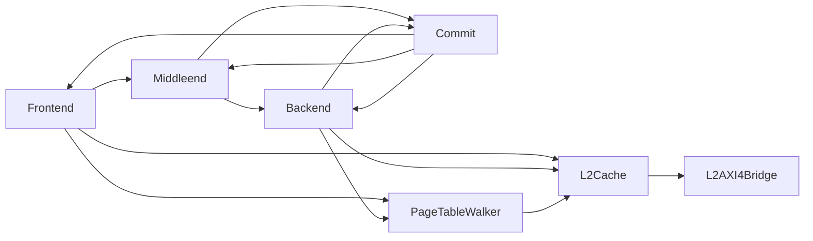

# ZirconCore

`ZirconCore` 是处理器集成顶层，例化 `Frontend`、`Middleend`、`Backend`、
`Commit`、`PageTableWalker`、`L2Cache` 和 `L2AXI4Bridge`。顶层负责连接模块接口、
中断输入、地址翻译控制和 AXI 主接口，不在顶层实现指令执行或缓存状态机。

## 外部接口

核心通过一个 AXI4 主接口访问外部存储器。中断输入包括机器软件中断、机器定时器中断、
机器外部中断和监管态外部中断。仿真版本额外导出三路退休信息、ROB 头状态和性能计数器；
综合版本不例化这些观测逻辑。

## 控制连接

`Commit` 保存当前特权级和 CSR 状态。顶层从 `satp`、当前特权级、`mstatus.MXR` 与
`mstatus.SUM` 生成统一的 `AddressTranslationControl`，送入 ITLB、DTLB 和 PTW。
`SFENCE.VMA` 触发 TLB 与 PTW 清空；`FENCE.I` 等待存储系统排空后请求 DCache 写回和
ICache 失效。

分支恢复和异常恢复由 `Commit` 广播到前端、中端和后端。前端使用恢复 PC 重新取指，
中端恢复映射状态，后端清除年轻指令和推测唤醒状态。
