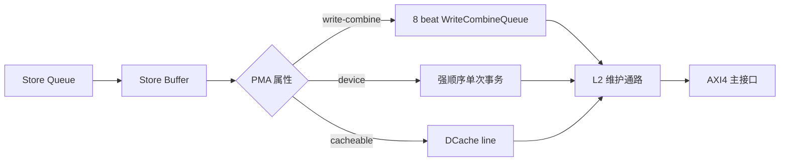

# 存储系统

Zircon-2026 的存储系统包含独立 ICache 与 DCache、ITLB 与 DTLB、共享 Sv32 PTW、偏非包含式
L2 Cache，以及连接外部 AXI4 主接口的 `L2AXI4Bridge`。L1 与 L2 使用 64 B Cache Line，
物理地址宽度为 34 位。

## L1 Cache

ICache 和 DCache 默认均为 2 路、16 set、64 B line，总容量各 2 KiB。ICache 提供四条指令的
块读取；DCache 提供两个固定 Load 端口和一个已提交 Store 端口。两者都使用三级命中流水，
并将 miss 状态保存在独立寄存器中，使状态机只读取末级请求。

DCache 的 Load 请求首先以虚拟地址索引 Tag/Data RAM，并把请求信息写入 lookup 寄存器。下一拍
RAM 数据返回时，DTLB 使用 lookup 中的虚拟地址产生物理地址，物理 Tag 与 RAM Tag 直接比较；
命中信息和翻译结果随后写入 execute 寄存器。末级完成 SQ/Store Buffer 转发合并、Load 响应和
miss 分配。DTLB miss、权限异常和对齐异常沿相同寄存边界返回，不会访问下级存储器。

两路 Load 与 Store Address 使用独立的 DTLB 查询口，可在同一拍完成地址翻译。若 LS1 Load 与
Store Address 同时发生 TLB miss，共享的缺页请求通道先服务 Load；Store Address 保持在流水
寄存器中等待后续处理。

DCache 采用 write-back、write-allocate。Store hit 在 L1 更新并置脏；Store miss 先取得整行
再合并字节 mask。DCache 使用单项 miss 单元，支持无冲突命中的 hit-under-miss；同一资源冲突
的 Load 返回 retry，由原发射队列表项重发。

原子操作只允许对可缓存、自然对齐的 32 位字执行。原子执行单元在提交授权后独占 LS1 Load
端口和 DCache Store 端口，以先读后写方式完成 AMO；不满足 PMA 或对齐要求的请求产生访存异常。

## 地址翻译

ITLB 有一个查询口，DTLB 有三个查询口。每个 TLB 的 4 KiB 页表项采用 4 set x 4 way 组织，
另有 4 项全相连的 4 MiB superpage 表。表项保存 VPN、PPN、权限、页大小、PMA 属性和当前
ASID 范围结果；查询路径使用 `VPN + inScope` 匹配。

TLB miss 进入共享两级 Sv32 `PageTableWalker`。PTW 在 I/D miss 之间仲裁，并分别复用 L2 的
I 侧和 D 侧查询通道。PTE 的 A/D 位必须已由软件设置，当前 PTW 不执行内存中的 A/D 位更新。

## L2 Cache

L2 默认 4 路、32 set、64 B line，总容量 8 KiB。I 侧和 D 侧各有独立的 S1、S2、S3 命中
流水；ICache 与 ITLB PTW 共享只读端口，DCache 与 DTLB PTW 共享读写端口。L1 请求具有首次
优先级，deferred 标志保证持续 Cache 流量不会饿死 PTW。

每侧的 victim line 数据保存在独立旁路寄存器中，直到快速命中将其转入后台缓冲，或维护引擎
接管该行。同侧下一条携带 victim 的请求在此前等待；普通查询和 PTW 请求仍可经过命中流水。

L2 主要保存 L1 替换出的 victim。L1 与 L2 同时 miss 时，外部填充直接返回 L1；只有 L1 victim
进入 L2。L2 命中后通常将数据所有权交给请求方并使条目失效。ICache 读取 dirty 数据时，L2
保留唯一 dirty 所有权。

Victim 安装优先选择可用的 invalid way，因此 I/D 两侧均可使用 set 中的空闲容量。set 已满时，
指令请求在指令占用达到 `maxInstructionWays` 后优先替换指令 line，数据请求优先替换数据 line；
候选集合使用 tree-PLRU 选择。这一规则是替换偏置，不对 way 进行静态划分。维护引擎还会排除
当前请求命中的 way，以及另一通道尚未消费的同 set 命中 way。

I/D 普通命中可以并行返回。Miss、victim 查询、dirty writeback、uncached 访问和安装操作共享
一个维护引擎及外部存储接口。L2 没有多项 MSHR；同一时刻只允许一个下级事务在途。

## PMA 与非缓存写合并

PMA 根据物理地址产生 cacheable、uncached memory 或 device 属性。TLB refill 时把静态 PMA
属性写入表项；地址翻译关闭时，PMA 与直接映射路径并行计算。Device 和普通 uncached 请求
绕过 Cache line 分配，以单个 32 位访问放在 64 位 AXI 数据 beat 的对应 lane 中送入下级接口；
Cache line refill/writeback 则按 64 位 beat 传输。

`0xa2000000` 至 `0xa2ffffff` 是面向设备描述符和连续控制数据的可合并写窗口。已提交的
32 位 Store 在 DCache 中进入 8 beat 写合并队列；同一 64 位 beat 的两个字按字节 mask 合并，
相邻 beat 组成 AXI4 INCR burst。队列不会跨越 4 KiB 边界，满 8 beat、短暂空闲或后续强顺序
访问都会结束当前 burst。普通 device、原子操作、Cache refill 与 writeback 不进入该队列。

写合并队列在一个 burst 内维护基地址、最后 beat 地址、下一 beat 地址、beat 数量，以及每个
beat 的 64 位数据和 8 位字节 strobe。当前与下一 beat 位置使用独热状态驱动数据写使能，避免
在宽数据寄存器输入前加入二进制索引译码。

| 队列状态 | 接收与输出行为 |
| --- | --- |
| 空 | 接收第一条可合并 Store，以 8 字节边界建立 burst 基地址 |
| 开放 | 合并当前 beat，或把紧邻的下一 beat 追加到 burst |
| 封口 | 停止接收新 Store，向 L2 发送已有 burst |
| 在途 | 保持数据和事务所有权，等待唯一的下级写响应 |

非连续地址、跨 4 KiB 边界和超过 8 beat 的请求不会加入当前 burst。非可合并 Store 到达时会
先封口并排空已有 burst，随后沿强顺序通路执行。L2 与 AXI Bridge 传递实际 beat 数、逐 beat
strobe 和连续数据；AXI `AWLEN` 等于 beat 数减一，所有合并写固定使用 8 字节传输宽度。

每条可合并 Store 在进入队列后向提交侧返回完成，队列继续负责下级 AXI 响应。后续强顺序
Store 只有在当前 burst 完成后才能进入 DCache，因此“写入描述符，再写门铃”的程序顺序无需
额外软件协议；`FENCE` 可用于明确标记描述符提交边界。

实现入口包括 [PMA.scala](../src/main/scala/Memory/PMA.scala)、
[WriteCombineQueue.scala](../src/main/scala/Backend/Memory/WriteCombineQueue.scala)、
[DCache.scala](../src/main/scala/Backend/Memory/DCache.scala) 和
[L2AXI4Bridge.scala](../src/main/scala/Memory/L2AXI4Bridge.scala)。合并、封口和 4 KiB 边界由
[WriteCombineQueueSpec.scala](../src/test/scala/Backend/Memory/WriteCombineQueueSpec.scala) 验证；
控制负载入口见 [TACLeBench lift](../RV-Software/taclebench/README.md#可合并写控制负载)。

## RAM 后端

Cache RAM 通过统一封装选择寄存器、Vivado 双口 BRAM 或 ASIC `1RW+1R` 接口。Vivado 配置
保留两个可读写物理端口；ASIC 分析配置将 I 侧绑定到只读端口，将 D 侧和安装写绑定到读写端口。

Chisel 与 Verilator 仿真使用同周期的行为模型。Nangate45 纯逻辑综合把 Cache 和 Predictor
SRAM 统一绑定到 BSG Fakeram：原生 `1RW` 数组直接
拆分到固定版本 BSG 宏，`1RW+1R` 接口使用由匹配深度 BSG 宏时序派生的双读口抽象。两个读口
都是上升沿 clock-to-Q。Vivado 后端使用独立的 Verilog BRAM 模板。
